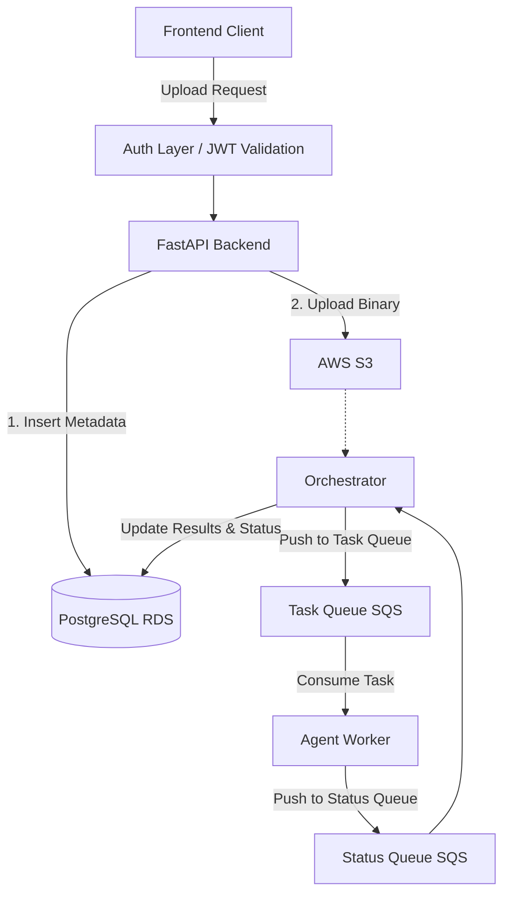

# AIA Backend Service

The AIA Backend Service is a robust FastAPI application responsible for handling secure document uploads, JWT-based authentication, PostgreSQL database management, and asynchronous integrations with AWS services (S3 and SQS). 

## Core Functionality

This service exposes several API endpoints to support document processing workflows:

- **`POST /api/upload`**: Validates JWT authentication and header identity, ensures files aren't duplicated, writes initial tracking metadata into PostgreSQL (marked as `Analysing`), and asynchronously uploads the physical binary file to an AWS S3 bucket.
- **`GET /api/fetchUploadHistory`**: Returns an authenticated user's entire historical log of uploaded documents, including current statuses and timestamps.
- **`GET /api/result?docID=...`**: Fetches the processing results and current status for a specific document identifier.
- **`GET /api/health`**: Simple health check endpoint for uptime monitoring and deployment readiness probes.

Behind the scenes, uploaded files are queued via SQS for downstream processing, the results of which are updated back to the database.

## Architecture



The application relies on an event-driven architecture. Once the FastAPI backend validates the client request, it persists tracking metadata in PostgreSQL and uploads the document to an S3 bucket. An **Orchestrator** detects the new document and pushes a job to the **Task Queue** (SQS). Downstream **Agents** consume from the Task Queue to perform intensive processing, after which they push the result to the **Status Queue**. Finally, the Orchestrator reads from the Status Queue and updates the final results back into the RDS database, which the client can poll.

## Prerequisites

Before setting up the project, ensure you have the following installed on your local machine:
- **Python 3.9+** (Virtual environment highly recommended)
- **Docker & Docker Compose** (Required for local PostgreSQL and LocalStack)
- **Git**

## Project Structure

- `app/api/`: Contains the FastAPI routers, endpoints, and authentication dependencies (`upload.py`, `health.py`, `upload_auth.py`).
- `app/models/`: Pydantic models for request/response validation and Enums (`upload_request.py`, `upload_response.py`, `document_record.py`, `enums.py`).
- `app/repositories/`: Houses the data access layer to isolate raw database queries from business logic (`document_repository.py`).
- `app/services/`: Core business logic, such as `upload_service.py`, `s3_service.py`, and the new `ingestor_service.py` (which handles text extraction and queueing).
- `app/worker.py`: The entry point for the background document ingestion worker.
- `app/utils/`: Global utility functions spanning logging, database connection pooling, JWT authorization, and system contexts (`app_context.py`).
- `app/core/`: The centralized heart of the application, containing configuration (`config.py`), global constants (`enums.py`), user-facing strings (`messages.py`), and DI providers (`dependencies.py`).
- `scripts/`: Shell scripts that automate the development workflow (`start_dev_server.sh`, `start-localstack.sh`).
- `compose.yml`: Docker Compose configuration defining LocalStack (S3, SQS, SNS) and PostgreSQL for seamless local development.

## Setup and Installation

### 1. Clone the repository
```bash
git clone <repository-url>
cd aia-backend
```

### 2. Create and Activate a Virtual Environment
```bash
python3 -m venv .venv
source .venv/bin/activate
```

### 3. Install Dependencies
Install both the core application and development dependencies using `pip`:
```bash
pip install -r requirements.txt
pip install -r requirements-dev.txt
```

### 4. Environment Configuration
The application relies on environment variables for configuration. Copy the example template to create your local `.env` file:
```bash
cp .env.example .env
```
*Note: Make sure your `.env` contains valid secrets (e.g., `JWT_SECRET`) and correct connection URIs for PostgreSQL and LocalStack.*

## Running in Development

### 1. Start Local Infrastructure
The backend depends heavily on PostgreSQL and mocked AWS services. To spin these up locally using Docker:
```bash
docker compose up -d
```
*Note: The Docker configuration automatically triggers `scripts/start-localstack.sh` upon initialization, which provisions the required S3 bucket (`docsupload`) and SQS queues (`task-queue`, `status-queue`).*

### 2. Start the FastAPI Server
You can start the development server quickly using the provided shell script:
```bash
./scripts/start_dev_server.sh
```
Alternatively, you can run `uvicorn` directly from your activated virtual environment:
```bash
# Start the API
uvicorn app.api.main:app --host 127.0.0.1 --port 8086 --reload

# Start the Orchestrator (in a separate terminal)
PYTHONPATH=. python -m app.orchestrator.main
```

The API will now be listening at `http://127.0.0.1:8086`.
You can view the auto-generated, interactive API documentation (Swagger UI) by navigating to `http://127.0.0.1:8086/docs` in your browser.

## Running Tests

To run the automated test suite, make sure your virtual environment is activated and execute:
```bash
PYTHONPATH=. pytest tests/
```

## Testing and Verification

To verify the end-to-end flow manually, you can use the following commands to inspect the state of each component:

### 1. Database (PostgreSQL)
Check the status of your uploaded documents in the database:
```bash
# Connect to PostgreSQL
docker exec -it aia-backend-db-1 psql -U aiauser -d aia_documents

# Query document status
SELECT doc_id, file_name, status, uploaded_ts FROM document_uploads ORDER BY uploaded_ts DESC;
```

### 2. Storage (S3)
Verify that the binary files are correctly stored in the local S3 bucket:
```bash
AWS_ACCESS_KEY_ID=test AWS_SECRET_ACCESS_KEY=test AWS_DEFAULT_REGION=eu-west-2 \
aws s3 ls s3://docsupload --endpoint-url http://localhost:4566 --recursive
```

### 3. Task Queue (SQS)
Check for tasks generated by the Orchestrator for downstream workers:

**To see the message count:**
```bash
AWS_ACCESS_KEY_ID=test AWS_SECRET_ACCESS_KEY=test AWS_DEFAULT_REGION=eu-west-2 \
aws sqs get-queue-attributes \
  --queue-url http://localhost:4566/000000000000/task-queue \
  --endpoint-url http://localhost:4566 \
  --attribute-names ApproximateNumberOfMessages
```

**To read/peek at messages:**
```bash
AWS_ACCESS_KEY_ID=test AWS_SECRET_ACCESS_KEY=test AWS_DEFAULT_REGION=eu-west-2 \
aws sqs receive-message \
  --queue-url http://localhost:4566/000000000000/task-queue \
  --endpoint-url http://localhost:4566 \
  --max-number-of-messages 10
```

### 4. Cleanup and Reset
To clear all data and start fresh:
```bash
# Clear Database
docker exec -it aia-backend-db-1 psql -U aiauser -d aia_documents -c "TRUNCATE document_uploads;"

# Clear S3 Bucket
AWS_ACCESS_KEY_ID=test AWS_SECRET_ACCESS_KEY=test AWS_DEFAULT_REGION=eu-west-2 \
aws s3 rm s3://docsupload --recursive --endpoint-url http://localhost:4566
```

## Contributing to this project

Please ensure that you format your code and run the tests prior to submitting any pull requests. Maintain the separation of concerns by keeping routing logic in `api/` and business logic in `services/`.
