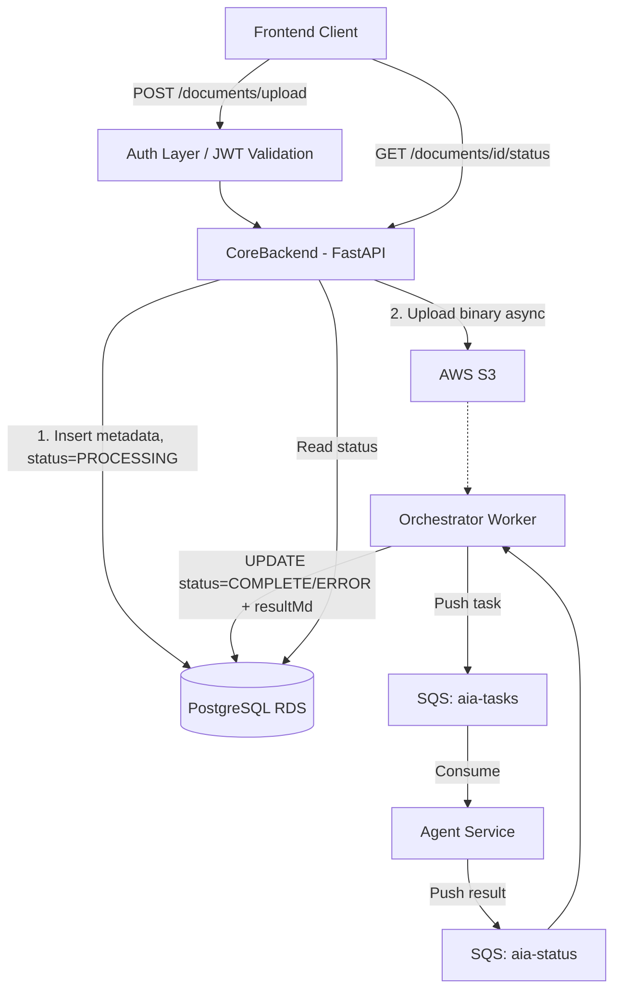

# AIA Backend Service

The AIA Backend Service is a FastAPI application responsible for secure document uploads, JWT-based authentication, PostgreSQL database management, and asynchronous AI assessment via AWS services (S3 and SQS).

## Core Functionality

The service exposes the following API endpoints under the base path `/api/v1`:

| Method | Path | Description |
|--------|------|-------------|
| GET | `/health` | Health check (no auth) |
| POST | `/api/v1/documents/upload` | Upload a document for AI assessment |
| GET | `/api/v1/documents/{documentId}/status` | Poll processing status |
| GET | `/api/v1/documents` | Paginated upload history |
| GET | `/api/v1/documents/{documentId}` | Full result with markdown assessment |
| GET | `/api/v1/users/me` | Authenticated user profile |

Full request/response contracts are documented in [docs/corebackend-api.md](docs/corebackend-api.md).

## Document Status Lifecycle

Uploaded documents move through three states:

```
PROCESSING  →  COMPLETE
     ↘
    ERROR
```

| Status | Terminal | Meaning |
|--------|----------|---------|
| `PROCESSING` | No | Upload received; AI assessment in progress |
| `COMPLETE` | Yes | Assessment done; `resultMd` populated |
| `ERROR` | Yes | Unrecoverable failure; `errorMessage` populated |

## Architecture



Once CoreBackend accepts the upload, it stores metadata in PostgreSQL (`status=PROCESSING`) and uploads the file to S3 asynchronously. The Orchestrator picks up the document, dispatches tasks to the **aia-tasks** SQS queue, and five specialist AI agents process it in parallel. Results flow back via **aia-status** and the Orchestrator writes the final markdown assessment to the database. The frontend polls the status endpoint until `COMPLETE` or `ERROR`.

## Prerequisites

- **Python 3.9+** (virtual environment recommended)
- **Docker & Docker Compose** (for local PostgreSQL and LocalStack)
- **Git**

## Project Structure

```
app/
├── api/
│   ├── main.py          # FastAPI app, router registration, lifespan
│   ├── documents.py     # /documents/* endpoints
│   ├── users.py         # /users/me endpoint
│   └── health.py        # /health endpoint
├── core/
│   ├── config.py        # Pydantic settings (env vars)
│   ├── dependencies.py  # FastAPI DI providers
│   ├── enums.py         # DocumentStatus (PROCESSING, COMPLETE, ERROR)
│   └── messages.py      # User-facing error strings
├── models/
│   ├── upload_request.py
│   ├── upload_response.py   # { documentId, status }
│   ├── status_record.py     # { documentId, status, errorMessage, createdAt, completedAt }
│   ├── history_record.py    # { documentId, originalFilename, templateType, status, ... }
│   ├── result_record.py     # { ..., resultMd, errorMessage }
│   ├── user_record.py       # { userId, email, name }
│   └── document_record.py
├── repositories/
│   ├── document_repository.py  # document_uploads table queries
│   └── user_repository.py      # users table queries + guest fallback
├── services/
│   ├── upload_service.py    # Upload, status, history, result
│   ├── ingestor_service.py  # Claim → extract → SQS dispatch
│   ├── s3_service.py
│   └── sqs_service.py
├── orchestrator/
│   └── main.py          # DocumentWorker — polls DB, drives ingestion
├── utils/
│   ├── postgres.py      # Connection pool, schema init (document_uploads + users)
│   ├── auth.py          # JWT validation (HS256)
│   ├── app_context.py   # UUID + timestamp utilities
│   └── logger.py
├── main.py              # Uvicorn entry-point shim
└── worker.py            # Orchestrator entry-point shim
docs/
└── corebackend-api.md   # Full API reference for frontend integration
```

## Setup and Installation

### 1. Clone the repository
```bash
git clone <repository-url>
cd aia-backend
```

### 2. Create and activate a virtual environment
```bash
python3 -m venv .venv
source .venv/bin/activate
```

### 3. Install dependencies
```bash
pip install -r requirements.txt
pip install -r requirements-dev.txt
```

### 4. Configure environment variables
```bash
cp .env.example .env
# Edit .env with your JWT_SECRET, POSTGRES_URI, S3/SQS config
```

## Running in Development

### 1. Start local infrastructure (PostgreSQL + LocalStack)
```bash
docker compose up -d
```

Docker Compose starts PostgreSQL and LocalStack. LocalStack initialises the `docsupload` S3 bucket and `task-queue` / `status-queue` SQS queues automatically via `scripts/start-localstack.sh`.

### 2. Start the API server
```bash
uvicorn app.api.main:app --host 127.0.0.1 --port 8086 --reload
```

### 3. Start the Orchestrator worker (separate terminal)
```bash
PYTHONPATH=. python -m app.orchestrator.main
```

The API will be available at `http://127.0.0.1:8086`.  
Swagger UI (interactive docs): `http://127.0.0.1:8086/docs`

## Running Tests

```bash
PYTHONPATH=. pytest tests/
```

## Verification and Debugging

### Check document status in the database
```bash
docker exec -it aia-backend-db-1 psql -U aiauser -d aia_documents

-- Query document lifecycle
SELECT doc_id, file_name, status, uploaded_ts, processed_ts
FROM document_uploads
ORDER BY uploaded_ts DESC;

-- Check users table
SELECT * FROM users;
```

### Check S3 uploads
```bash
AWS_ACCESS_KEY_ID=test AWS_SECRET_ACCESS_KEY=test AWS_DEFAULT_REGION=eu-west-2 \
aws s3 ls s3://docsupload --endpoint-url http://localhost:4566 --recursive
```

### Check SQS task queue
```bash
AWS_ACCESS_KEY_ID=test AWS_SECRET_ACCESS_KEY=test AWS_DEFAULT_REGION=eu-west-2 \
aws sqs get-queue-attributes \
  --queue-url http://localhost:4566/000000000000/task-queue \
  --endpoint-url http://localhost:4566 \
  --attribute-names ApproximateNumberOfMessages
```

### Reset local state
```bash
# Clear database
docker exec -it aia-backend-db-1 psql -U aiauser -d aia_documents \
  -c "TRUNCATE document_uploads; TRUNCATE users CASCADE;"

# Clear S3
AWS_ACCESS_KEY_ID=test AWS_SECRET_ACCESS_KEY=test AWS_DEFAULT_REGION=eu-west-2 \
aws s3 rm s3://docsupload --recursive --endpoint-url http://localhost:4566
```

## Contributing

Format code and run tests before submitting a pull request. Keep routing logic in `api/`, business logic in `services/`, and data access in `repositories/`.
