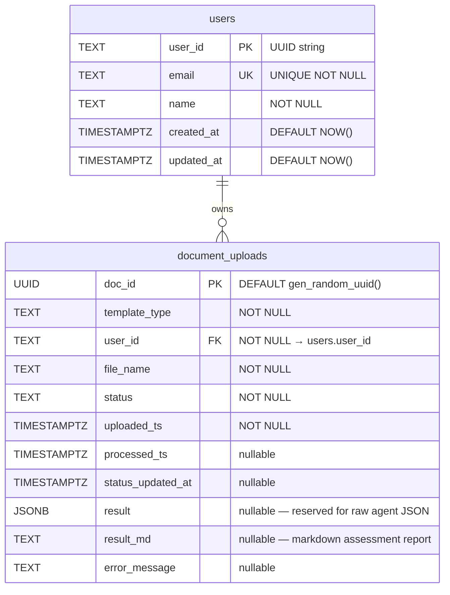

# AIA Backend — Database Schema

**Version:** 1.0 (POC)  
**Last Updated:** 2026-04-27  
**Database:** PostgreSQL (AWS RDS)  
**Managed by:** `app/utils/postgres.py` — `init_db()` runs on service startup

---

## Overview

The AIA Backend uses two tables:

| Table | Purpose |
|-------|---------|
| `users` | Authenticated user identities |
| `document_uploads` | Document lifecycle, processing status, and assessment results |

Both tables are created with `CREATE TABLE IF NOT EXISTS` and are safe to run on each startup. Additive column migrations run as `ALTER TABLE … ADD COLUMN IF NOT EXISTS` statements, also idempotent.

---

## Entity Relationship Diagram



---

## Table: `users`

Stores authenticated user accounts. During the POC phase a single guest user is seeded on every startup.

### DDL

```sql
CREATE TABLE IF NOT EXISTS users (
    user_id    TEXT        PRIMARY KEY,
    email      TEXT        NOT NULL UNIQUE,
    name       TEXT        NOT NULL,
    created_at TIMESTAMPTZ NOT NULL DEFAULT NOW(),
    updated_at TIMESTAMPTZ NOT NULL DEFAULT NOW()
);

-- Seeded guest user (POC only — replaced by EntraID SSO in production)
INSERT INTO users (user_id, email, name)
VALUES ('00000000-0000-0000-0000-000000000001', 'guest@aia.local', 'Guest User')
ON CONFLICT (user_id) DO NOTHING;
```

### Columns

| Column | Type | Nullable | Description |
|--------|------|----------|-------------|
| `user_id` | TEXT | No | UUID string — primary key. Comes from JWT `sub` claim. |
| `email` | TEXT | No | User email address — unique. |
| `name` | TEXT | No | Display name. |
| `created_at` | TIMESTAMPTZ | No | Row creation time (UTC). Defaults to `NOW()`. |
| `updated_at` | TIMESTAMPTZ | No | Last profile update time (UTC). Defaults to `NOW()`. |

### Indexes

| Index | Type | Columns | Notes |
|-------|------|---------|-------|
| `users_pkey` | PRIMARY KEY | `user_id` | Auto-created |
| `users_email_key` | UNIQUE | `email` | Auto-created from `UNIQUE` constraint |

---

## Table: `document_uploads`

Tracks the full lifecycle of each uploaded document, from initial `PROCESSING` through to a terminal status. The Orchestrator writes assessment results here; CoreBackend reads from this table to serve the frontend.

### DDL

```sql
CREATE TABLE IF NOT EXISTS document_uploads (
    doc_id            UUID        PRIMARY KEY DEFAULT gen_random_uuid(),
    template_type     TEXT        NOT NULL,
    user_id           TEXT        NOT NULL,
    file_name         TEXT        NOT NULL,
    status            TEXT        NOT NULL,
    uploaded_ts       TIMESTAMPTZ NOT NULL,
    processed_ts      TIMESTAMPTZ,
    status_updated_at TIMESTAMPTZ,
    result            JSONB,
    result_md         TEXT,
    error_message     TEXT
);

CREATE UNIQUE INDEX IF NOT EXISTS idx_user_filename
    ON document_uploads (user_id, file_name);
```

### Columns

| Column | Type | Nullable | Description |
|--------|------|----------|-------------|
| `doc_id` | UUID | No | Document identifier — primary key. Auto-generated via `gen_random_uuid()`. Returned to the frontend as `documentId`. |
| `template_type` | TEXT | No | Assessment template identifier (e.g. `SDA`). Passed to the Agent Service to select the correct evaluation criteria. |
| `user_id` | TEXT | No | Foreign key to `users.user_id`. Ensures documents are scoped to their owner. |
| `file_name` | TEXT | No | Original filename supplied by the user. Combined with `user_id` as a unique key to prevent duplicate uploads. |
| `status` | TEXT | No | Current document lifecycle status. See [Status Values](#status-values) below. |
| `uploaded_ts` | TIMESTAMPTZ | No | Timestamp when the upload request was accepted by CoreBackend. |
| `processed_ts` | TIMESTAMPTZ | Yes | Timestamp when the Orchestrator wrote a terminal status. `null` while `PROCESSING`. |
| `status_updated_at` | TIMESTAMPTZ | Yes | Timestamp of the most recent status change. Updated on every `UPDATE` by both CoreBackend and the Orchestrator. |
| `result` | JSONB | Yes | Reserved for raw structured agent output. Not currently populated; `result_md` is used instead. |
| `result_md` | TEXT | Yes | Markdown-formatted assessment report generated by `MarkdownSummaryGenerator`. Populated on `COMPLETE` and `PARTIAL_COMPLETE`. `null` on `ERROR`. |
| `error_message` | TEXT | Yes | Human-readable error description. Populated on `ERROR` and `PARTIAL_COMPLETE`. Lists non-responding agent types on partial timeout. |

### Indexes

| Index | Type | Columns | Notes |
|-------|------|---------|-------|
| `document_uploads_pkey` | PRIMARY KEY | `doc_id` | Auto-created |
| `idx_user_filename` | UNIQUE | `(user_id, file_name)` | Prevents the same user uploading a file with the same name twice — returns `HTTP 400` to the frontend |

---

## Status Values

The `status` column drives the document processing lifecycle. Only `PROCESSING` is non-terminal; all other statuses are final.

```
           ┌──────────────┐
           │  PROCESSING  │◄─── inserted on upload (CoreBackend)
           └──────┬───────┘
                  │
         ┌────────┼─────────────────────────┐
         ▼        ▼                         ▼
     COMPLETE  PARTIAL_COMPLETE           ERROR
  (all agents  (timeout, ≥1 result)   (timeout, 0 results
   responded)                          OR S3/extraction fail)
```

| Status | Terminal | `result_md` | `error_message` | Set by |
|--------|----------|-------------|-----------------|--------|
| `PROCESSING` | No | `null` | `null` | CoreBackend on upload |
| `CLAIMED` | No (internal) | `null` | `null` | `DocumentRepository.claim_pending_documents()` — not surfaced via API |
| `COMPLETE` | **Yes** | Full report | `null` | Orchestrator |
| `PARTIAL_COMPLETE` | **Yes** | Partial report | Lists non-responding agent types | Orchestrator |
| `ERROR` | **Yes** | `null` | Exception message | Orchestrator |

> **`CLAIMED`** is an internal marker used to prevent double-processing. It is never returned to the frontend or included in API responses.

---

## Foreign Key Relationship

`document_uploads.user_id → users.user_id`

This relationship is enforced in application code (not as a DB-level `FOREIGN KEY` constraint in the current POC). CoreBackend always passes a validated `user_id` from the JWT; the `NOT NULL` constraint ensures no orphaned records.

---

## Query Patterns

### Insert on upload

```sql
INSERT INTO document_uploads
    (doc_id, template_type, user_id, file_name, status,
     uploaded_ts, processed_ts, status_updated_at, result, result_md, error_message)
VALUES ($1::uuid, $2, $3, $4, 'PROCESSING', $5, NULL, $5, NULL, NULL, NULL)
```

### Update status (Orchestrator terminal write)

```sql
UPDATE document_uploads
SET status            = $1,
    processed_ts      = $2,
    status_updated_at = $2,
    result_md         = COALESCE($3, result_md),
    error_message     = COALESCE($4, error_message)
WHERE doc_id = $5::uuid
```

### Fetch in-progress IDs (frontend polling)

```sql
SELECT doc_id::text AS "documentId"
FROM document_uploads
WHERE user_id = $1 AND status = 'PROCESSING'
ORDER BY uploaded_ts DESC
```

### Fetch full result (after COMPLETE)

```sql
SELECT doc_id::text, file_name, template_type, status,
       result_md, error_message, uploaded_ts, processed_ts
FROM document_uploads
WHERE doc_id = $1::uuid AND user_id = $2
```

### Duplicate check (before insert)

```sql
SELECT doc_id FROM document_uploads
WHERE user_id = $1 AND file_name = $2
```

---

## Migration Strategy

The `init_db()` function in `app/utils/postgres.py` runs on every service startup and applies migrations idempotently:

```python
_MIGRATE_SQL_STATEMENTS = [
    "ALTER TABLE document_uploads ADD COLUMN IF NOT EXISTS status_updated_at TIMESTAMPTZ;",
    "ALTER TABLE document_uploads ADD COLUMN IF NOT EXISTS result_md TEXT;",
    "ALTER TABLE document_uploads ADD COLUMN IF NOT EXISTS error_message TEXT;",
]
```

This means:
- New deployments create tables from scratch via `CREATE TABLE IF NOT EXISTS`
- Existing deployments get missing columns added via `ADD COLUMN IF NOT EXISTS`
- No manual migration scripts are needed for column additions

For destructive changes (column renames, type changes, dropped columns) a manual migration script is required before deploying.

---

## Verification

Check the schema and data during development:

```bash
# Connect to the local database
docker exec -it aia-backend-db-1 psql -U aiauser -d aia_documents

-- Inspect table structure
\d document_uploads
\d users

-- Query recent documents
SELECT doc_id, file_name, status, uploaded_ts, processed_ts
FROM document_uploads
ORDER BY uploaded_ts DESC
LIMIT 20;

-- Check for stuck PROCESSING rows
SELECT doc_id, file_name, status, uploaded_ts
FROM document_uploads
WHERE status = 'PROCESSING'
ORDER BY uploaded_ts ASC;

-- Check users
SELECT * FROM users;
```
